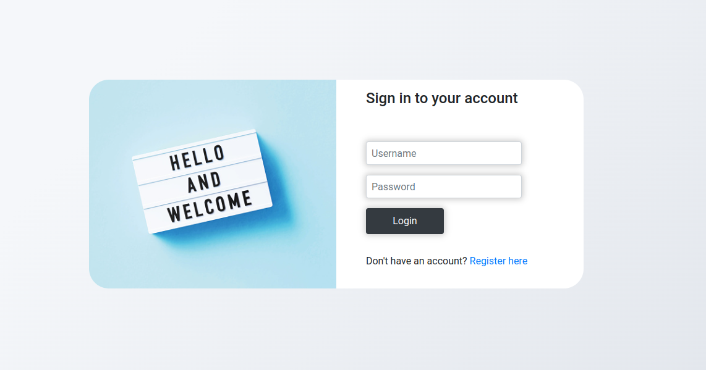

<h1 align="center">
	
</h1>

# Online store made in Spring boot, mvc and Thymeleaf.


------------

#### Use Case - Complete Shopping from Scratch:
- Firstly, must be logged in to the website by using the Login/Register button on the navigation bar.
- To explore the products, the Products button must be clicked. And, the required products are added to Cart.
- Then, when clicked to the Cart button, all the shopping items, their prices and total price appear on the page. Changes can be done in this stage by increasing the quantity of the products or deleting them.
- To proceed to the payment stage, Complete the Shopping button must be clicked.
- Following the Cart confirmation, a new form appears. Information of Address, Credit Card Number is typed.
- The code that has been sent to the registered phone number is typed. (No code being sent to the user, it's just the template for now)
- Finally, Order Summary is created and welcomed to the Customer. If the details of the Order is required, the Order Details button must be clicked.


### Datasource config
```
spring.datasource.url=jdbc:postgresql://localhost:5432/ProjectName
spring.datasource.username=username
spring.datasource.password=password
spring.datasource.driver=org.postgresql.Driver
        
```
<br>

### Hibernate config
```
hibernate.dialect=org.hibernate.dialect.PostgreSQLDialect
hibernate.show_sql=true
hibernate.hbm2ddl.auto=update
hibernate.cache.use_second_level_cache=false
hibernate.cache.use_query_cache=false
hibernate.maximum.pool.size=20
hibernate.idle.count=10
hibernate.idle.timeout=600000

```

<h1></h1>

A Spring MVC is a Java framework which is used to build web applications. It follows the Model-View-Controller design pattern. It implements all the basic features of a core spring framework like Inversion of Control, Dependency Injection.

A Spring MVC provides an elegant solution to use MVC in spring framework by the help of DispatcherServlet. Here, DispatcherServlet is a class that receives the incoming request and maps it to the right resource such as controllers, models, and views.

<p align="center">
  
</p>

- Model - A model contains the data of the application. A data can be a single object or a collection of objects.
- Controller - A controller contains the business logic of an application. Here, the @Controller annotation is used to mark the class as the controller.
- View - A view represents the provided information in a particular format. Generally, JSP+JSTL is used to create a view page. Although spring also supports other view technologies such as Apache Velocity, Thymeleaf and FreeMarker.
- Front Controller - In Spring Web MVC, the DispatcherServlet class works as the front controller. It is responsible to manage the flow of the Spring MVC application.

<p align="center">
  
</p>

- As displayed in the figure, all the incoming request is intercepted by the DispatcherServlet that works as the front controller.
- The DispatcherServlet gets an entry of handler mapping from the XML file and forwards the request to the controller.
- The controller returns an object of ModelAndView.
- The DispatcherServlet checks the entry of view resolver in the XML file and invokes the specified view component.

------------




